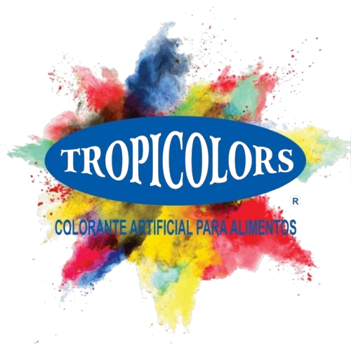

# TropiColors 🌈

> Premium food colorants e-commerce platform built with React, TypeScript, and Tailwind CSS.

<p align="center">
  
</p>

## 📋 Table of Contents

- [Description](#description)
- [Features](#features)
- [Tech Stack](#tech-stack)
- [Project Structure](#project-structure)
- [Getting Started](#getting-started)
- [Environment Variables](#environment-variables)
- [Deployment](#deployment)
- [Support](#support)

## 🌟 Description

**TropiColors** is a modern e-commerce platform specialized in premium food colorants for the Mexican market. The website showcases a wide variety of powder colorants with different concentrations (125g and 250g), organized by color categories.

The platform features a premium UI/UX design with smooth animations, glassmorphism effects, and a responsive mobile-first approach.

## ✨ Features

### Core Features
- 🛒 **Shopping Cart** - Add products, manage quantities, checkout
- 📱 **Responsive Design** - Works perfectly on mobile, tablet, and desktop
- 🔍 **Product Filtering** - Filter by color category
- 🎚️ **Concentration Selector** - Toggle between 125g and 250g options
- 💬 **WhatsApp Integration** - Direct contact for quotes
- 🏷️ **Price Display** - Shows prices with IVA included

### UI/UX Features
- 🎨 **Premium Design** - Apple/Stripe-inspired interface
- ✨ **Smooth Animations** - Framer Motion animations throughout
- 🧊 **Glassmorphism** - Modern frosted glass effects
- 📱 **Mobile Menu** - Animated hamburger menu
- 🔔 **Toast Notifications** - Interactive feedback
- 🛒 **Cart Drawer** - Slide-out cart with item management
- 🚀 **Scroll Snap** - Smooth section-by-section scrolling

## 🛠 Tech Stack

| Category | Technology |
|----------|------------|
| **Frontend** | React 18, TypeScript |
| **Styling** | Tailwind CSS v4 |
| **Animations** | Framer Motion |
| **Routing** | Wouter |
| **Build Tool** | Vite |
| **Package Manager** | pnpm |
| **Monorepo** | pnpm Workspace |

## 📁 Project Structure

```
TropicColors/
├── artifacts/
│   ├── tropicolors/          # Main frontend application
│   │   ├── src/
│   │   │   ├── components/   # React components
│   │   │   │   ├── ui/       # Reusable UI components
│   │   │   │   ├── Navbar.tsx
│   │   │   │   ├── Footer.tsx
│   │   │   │   ├── HeroLanding.tsx
│   │   │   │   └── CartDrawer.tsx
│   │   │   ├── context/       # React context
│   │   │   │   └── CartContext.tsx
│   │   │   ├── pages/        # Page components
│   │   │   │   ├── Home.tsx
│   │   │   │   └── Admin.tsx
│   │   │   ├── App.tsx
│   │   │   └── main.tsx
│   │   ├── public/           # Static assets
│   │   │   ├── images/
│   │   │   ├── logo-tropicolors.png
│   │   │   └── hero-landing.png
│   │   └── package.json
│   │
│   ├── api-server/           # Backend API (optional)
│   └── mockup-sandbox/       # UI component testing
│
├── package.json              # Root package.json
├── pnpm-workspace.yaml      # pnpm workspace config
└── tsconfig.base.json       # Base TypeScript config
```

## 🚀 Getting Started

### Prerequisites

- **Node.js** >= 18.0.0
- **pnpm** >= 8.0.0

### Installation

1. **Clone the repository**
   ```bash
   git clone https://github.com/Richi201012/TropicColorsF.git
   cd TropiColorsF
   ```

2. **Install dependencies**
   ```bash
   pnpm install
   ```

3. **Start development server**
   ```bash
   cd artifacts/tropicolors
   pnpm dev
   ```

4. **Open in browser**
   ```
   http://localhost:5173
   ```

### Build for Production

```bash
cd artifacts/tropicolors
pnpm build
```

The built files will be in `artifacts/tropicolors/dist/`

## 🔑 Environment Variables

The following environment variables are used (already configured in the project):

| Variable | Description | Default |
|----------|-------------|---------|
| `BASE_URL` | Base URL for assets | `/` |

For production deployment, adjust these based on your hosting platform.

## 📦 Deployment

### Option 1: Static Hosting (Recommended)

Deploy the `dist/` folder to any static hosting service:

- **Vercel** - `pnpm vercel`
- **Netlify** - Drag & drop the dist folder
- **GitHub Pages** - Use GitHub Actions
- **AWS S3** - Upload the dist folder

### Option 2: Docker

```dockerfile
FROM nginx:alpine
COPY artifacts/tropicolors/dist /usr/share/nginx/html
EXPOSE 80
```

### Option 3: Build and Serve

```bash
cd artifacts/tropicolors
pnpm build
pnpm preview
```

## 📞 Support

### Contact Information

- **WhatsApp**: [+52 55 5114 6856](https://wa.me/525551146856)
- **Toll Free**: 01 800 8 36 74 68
- **Email**: m_tropicolors@hotmail.com
- **Address**: Abedules Mz.1 Lt.36, Ejército del Trabajo II, Ecatepec, Edo. Mex. C.P. 55238

### Social Media

- [Facebook](https://www.facebook.com/share/1c23hr7sLP/?mibextid=wwXIfr)
- [Instagram](https://www.instagram.com/tropicolors_mx?igsh=MTBnZDNmenBjMTRzeA==)

---

<p align="center">
  Made with ❤️ by <strong>TropicColors</strong>
</p>
